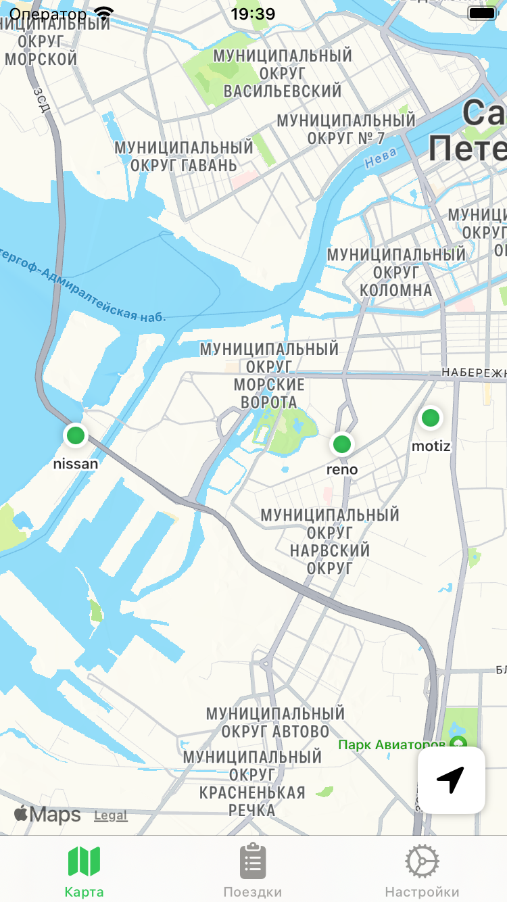

# Неофициальный клиент CityDrive

Для iOS 17 и выше. По первой же просьбе СитиДрайва приложение будет убрано из публичного доступа!

<span></span>

#### Структура проекта

```xml
CityDrive
├── NetworkLayer
│   ├── Endpoint
│   │   └── ...
│   ├── Service
│   │   ├── NetworkRouter      <- interface for router
│   │   ├── EndpointType       <- interface for endpoint
│   │   └── ...
│   ├── Manager
│   │   └── ...
│   ├── Encoding               <- json and url parameters encoders
│   │   └── ...
│   └── Model                  <- response and request models
│       └── ...
├── View
│   └── ...
├── Model
│   └── ...
├── ViewModel
│   └── ...
├── MapView
├── CityDriveApp
└── ...                        <- Extentions and Resourses
```

## Технологии

- [SwiftUI](https://developer.apple.com/xcode/swiftui/)
- [Сетевой слой](https://habr.com/ru/articles/443514/)
- [Безопасность токена](https://github.com/jrendel/SwiftKeychainWrapper)
