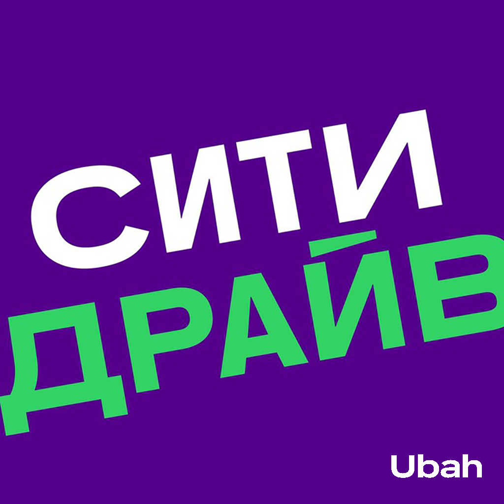
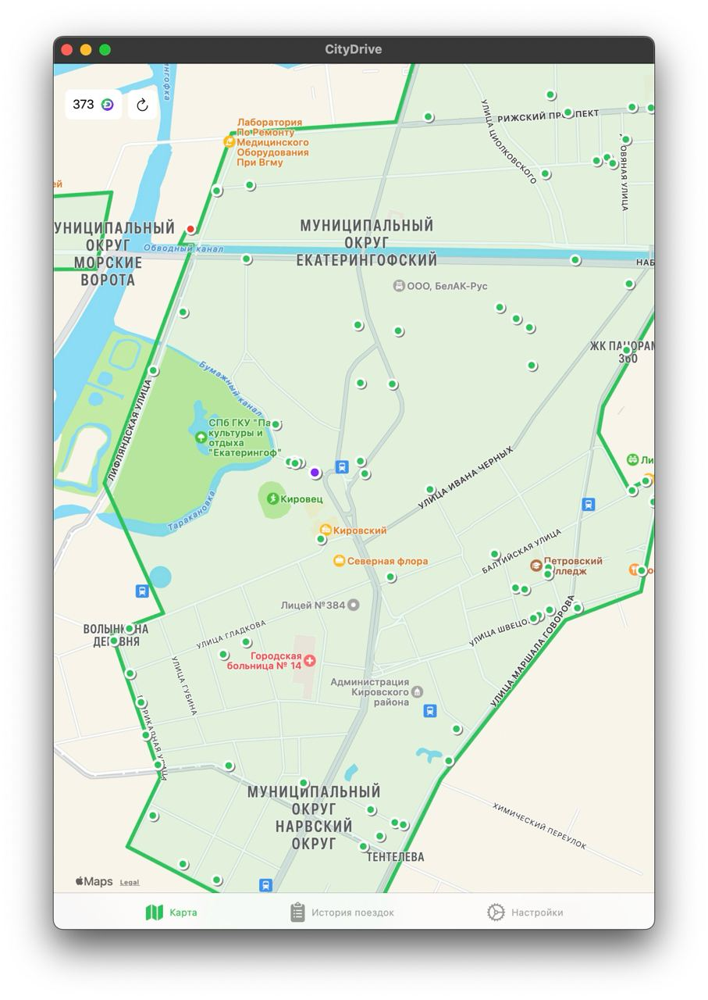
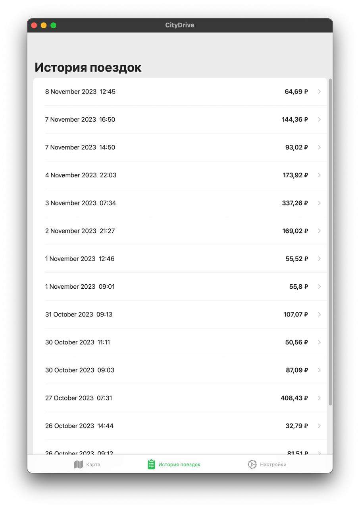
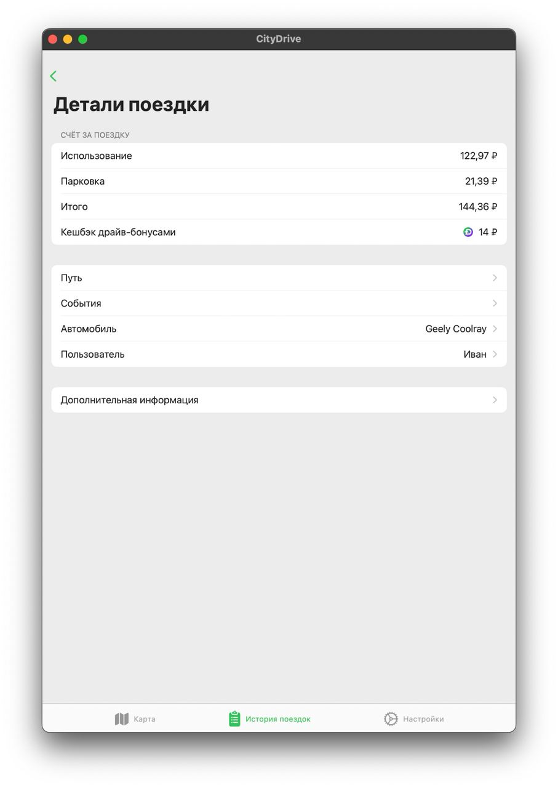
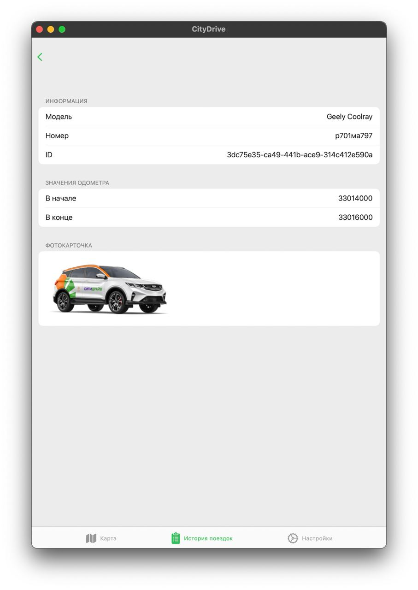
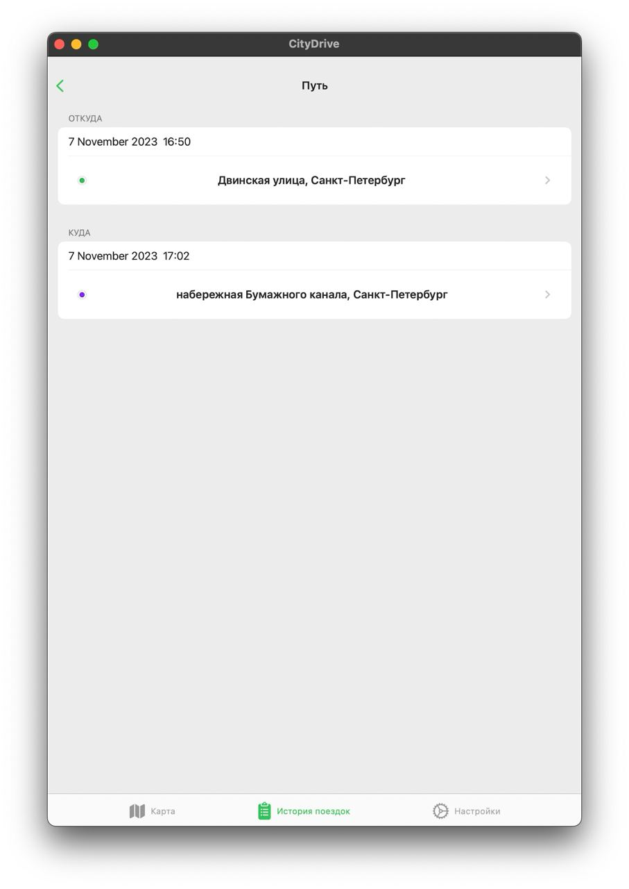
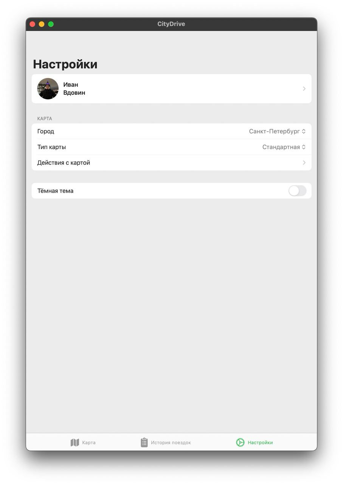

# Неофициальный клиент CityDrive

<div align="center">
    
</div>


Данное приложение не несёт цели навредить репутации и информационной безопасности сервиса СитиДрайв. По первой же просьбе представителей каршеринга приложение будет убрано из публичного доступа.

<div style="display: flex; flex-direction: row; flex-wrap: wrap; justify-content: center; column-gap: 24px; row-gap: 20px;">
  
  
  
  
  
  
  
</div>

## Структура проекта

```
CityDrive
├── NetworkLayer
│   ├── Endpoint
│   │   └── ...
│   ├── Service
│   │   ├── NetworkRouter <- interface for router
│   │   ├── EndpointType  <- interface for endpoint
│   │   └── ...
│   ├── Manager
│   │   └── ...
│   ├── Encoding          <- json and url parameters encoders
│   │   └── ...
│   └── Model             <- response and request models
│       └── ...
├── View
│   └── ...
├── Model
│   └── ...
├── ViewModel
│   └── ...
├── MapView
├── CityDriveApp
└── ...                   <- Extensions and Resourses
```

## Технологии и инструменты

- [SwiftUI](https://developer.apple.com/xcode/swiftui/)
- [MapKit](https://developer.apple.com/documentation/mapkit/mapkit_for_swiftui)
- [Сетевой слой](https://habr.com/ru/articles/443514/)
- [Безопасность токена](https://github.com/jrendel/SwiftKeychainWrapper)

- [Postman](https://www.postman.com/)
- [Proxyman](https://proxyman.io/)
- [SSL Pinning](https://gist.github.com/UbahWin/fd4ccec403e41de3918df2f863bd8e91)
- [SwiftLint](https://github.com/realm/SwiftLint)
